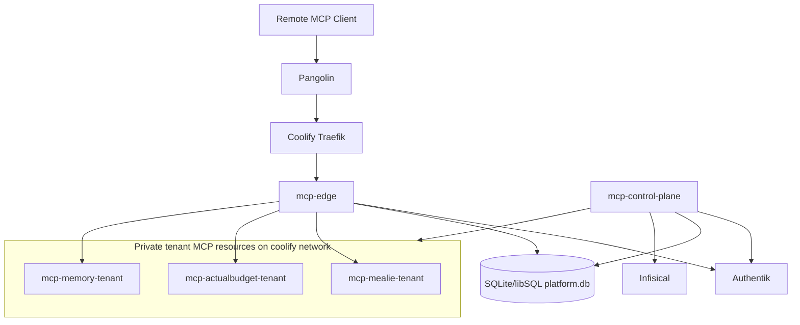

# Architecture Record Document

Document: MCP Control Plane ARD  
Status: Accepted target architecture  
Date: 2026-03-20  
Deciders: DragonServer platform

## 1. Context

DragonServer currently operates multiple MCP services with inconsistent exposure, authentication, and lifecycle patterns.

The new control plane must satisfy all of the following simultaneously:

- Linear-style remote MCP user experience
- Authentik-based RBAC
- one backend instance per `user x service`
- Coolify-native runtime management
- dedicated secret management from day one
- compatibility with existing MCP servers without redesigning each server into a shared multi-tenant platform

## 2. Final Architecture

## 3. Accepted Decisions

## Decision 1: Use one shared public MCP domain with per-service paths

### Decision

The platform will expose a single public domain:

- `https://mcp.zacariahheim.com`

with canonical service endpoints:

- `https://mcp.zacariahheim.com/mealie/mcp`
- `https://mcp.zacariahheim.com/actualbudget/mcp`
- `https://mcp.zacariahheim.com/memory/mcp`

### Rationale

- matches the preferred UX used by providers such as Linear
- removes per-user URL configuration from the client
- keeps client setup stable even when tenant placement changes
- aligns cleanly with MCP authorization metadata discovery

### Consequences

- user identity must be derived from tokens rather than hostnames
- the shared edge becomes a required control point

## Decision 2: Do not use public per-user aliases

### Decision

Per-user aliases are rejected as the primary client-facing UX.

### Rationale

- the preferred UX is a single shared public endpoint per service
- aliases leak user identity into public routing
- aliases complicate certificate and routing design without improving the client experience
- mutable usernames or aliases create avoidable lifecycle complexity

### Consequences

- any future aliasing, if added, will be secondary and not canonical

## Decision 3: The shared edge is the MCP-facing OAuth broker and resource server

### Decision

`mcp-edge` will implement the MCP-facing OAuth and resource-server behavior required by remote MCP clients.

It will delegate human identity verification to Authentik, but it will not require clients to talk to Authentik directly as the MCP authorization server.

### Rationale

- remote MCP clients expect standards-compliant browser-based OAuth
- the preferred UX depends on MCP-oriented authorization discovery and client compatibility
- Authentik is the right human IdP, but not the right MCP-facing integration point for this design

### Consequences

- `mcp-edge` must implement or adopt a robust OAuth layer
- token issuance, refresh, registration, and validation become platform responsibilities

## Decision 4: Keep backend isolation at one instance per `user x service`

### Decision

Every MCP service will run as a distinct isolated backend per user.

### Rationale

- preserves the original isolation goal
- avoids turning vanilla MCP servers into shared multi-tenant systems
- reduces cross-user blast radius
- keeps authorization boundaries simple at the backend level

### Consequences

- higher runtime resource use than a shared backend
- requires a control plane to manage instance lifecycle predictably

## Decision 5: All tenant workloads must be Coolify-managed resources

### Decision

Tenant backends will be created and maintained as real Coolify-managed resources, visible in the Coolify UI.

### Rationale

- this is an explicit platform requirement
- operators need Coolify-native discoverability and operational control
- the design must fit the existing DragonServer operating model

### Consequences

- tenant lifecycle is constrained by what Coolify can manage through its API
- the platform will use Coolify as the tenant runtime surface, not direct Docker orchestration

## Decision 6: All workloads run on the `coolify` Docker network

### Decision

The edge, control plane, and all tenant MCP resources will run on the `coolify` Docker network.

### Rationale

- matches the current DragonServer networking pattern
- allows service discovery through the same internal routing surface
- avoids introducing a parallel networking plane for the first production design

### Consequences

- tenant workloads must be kept private by routing policy, not by network absence
- network-level hardening must assume shared-network coexistence

## Decision 7: Infisical is the canonical secret store

### Decision

Infisical is the source of truth for:

- platform secrets
- per-user upstream service credentials

### Rationale

- a dedicated secret store is required from day one
- Infisical is operationally lighter than Vault for the current stack
- Infisical integrates cleanly into a self-hosted Docker/Coolify environment

### Consequences

- the platform must implement secret synchronization or runtime delivery for vanilla MCP services
- Coolify may hold derived runtime secret copies for compatibility, but never as source of truth

## Decision 8: Use immutable `sub` as the canonical user key

### Decision

The platform will treat the OIDC `sub` claim as the canonical subject identity.

### Rationale

- usernames and emails can change
- tenant and audit integrity require stable identifiers
- cross-service lifecycle logic should never depend on mutable profile fields

### Consequences

- internal tenant identifiers will be derived from `sub`
- display names remain descriptive only

## Decision 9: Preserve vanilla MCP compatibility through adapters and controlled secret injection

### Decision

The platform will not require upstream MCP servers to become secret-store-aware or multi-tenant-aware.

Instead, it will support:

- controlled env/file injection for tenant services
- transport normalization behind the edge where needed

### Rationale

- reducing service-specific modifications is a stated goal
- the platform should work with existing MCPs as much as possible

### Consequences

- some services may require adapter layers
- the control plane must manage compatibility contracts carefully

## Decision 10: Retire direct public MCP exposure

### Decision

Direct public MCP routes for tenant services are not part of the target architecture and must be retired after cutover.

### Rationale

- the edge must be the single authorization and routing boundary
- direct public service routes bypass centralized policy and audit

### Consequences

- existing public endpoints are transitional only
- migration must include client reconfiguration and route removal

## 4. Rejected Alternatives

## Rejected: Per-user public aliases as the primary model

Rejected because the preferred client UX is shared-domain and browser-auth-based, not per-user-host based.

## Rejected: Raw Docker orchestration outside Coolify

Rejected because tenant workloads must remain discoverable and operable in the Coolify UI.

## Rejected: Shared multi-tenant MCP backends

Rejected because the platform must preserve one isolated backend per `user x service`.

## Rejected: Direct Authentik-as-MCP-auth-server design

Rejected because the desired MCP client UX needs an MCP-facing auth layer that fits remote MCP authorization expectations without pushing client registration complexity onto Authentik.

## Rejected: Commercial gateway foundation

Rejected because the DragonServer platform should remain self-hosted and operable within the current Coolify-centered stack without introducing a paid control-plane dependency as the core runtime requirement.

## 5. Operational Consequences

### Positive

- one clean public MCP experience
- one central authorization boundary
- one consistent tenant model
- one secret source of truth
- one coherent migration away from current ad hoc MCP patterns

### Costs

- more platform code in `mcp-edge` and `mcp-control-plane`
- more tenant resources visible in Coolify
- more secret synchronization and reconciliation complexity

### Risk Areas

- OAuth implementation quality at the edge
- transport normalization for `memory`
- Coolify scale and reconciliation behavior under higher tenant counts

## 6. Required Follow-Through

This architecture is only complete if the following are implemented together:

1. shared edge domain and metadata
2. delegated Authentik login
3. Coolify-native tenant reconciliation
4. Infisical secret integration
5. tenant privacy enforcement
6. retirement of direct public MCP routes

Implementing only a subset recreates the current fragmented state in a new form and is therefore not acceptable.
