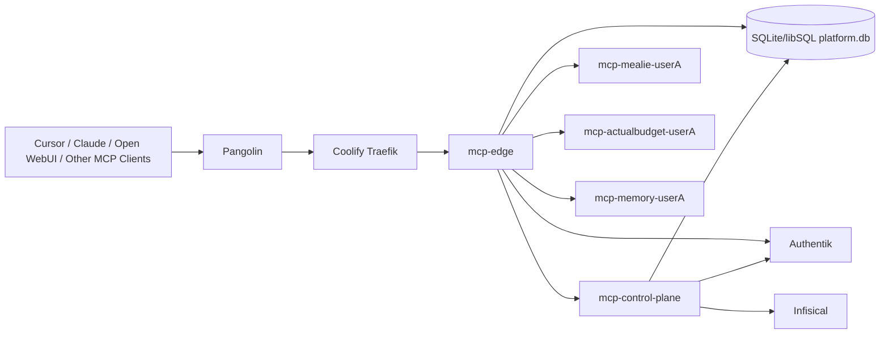
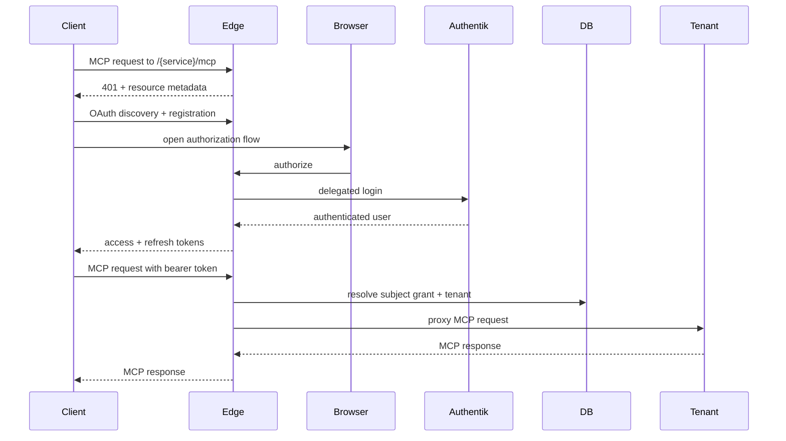
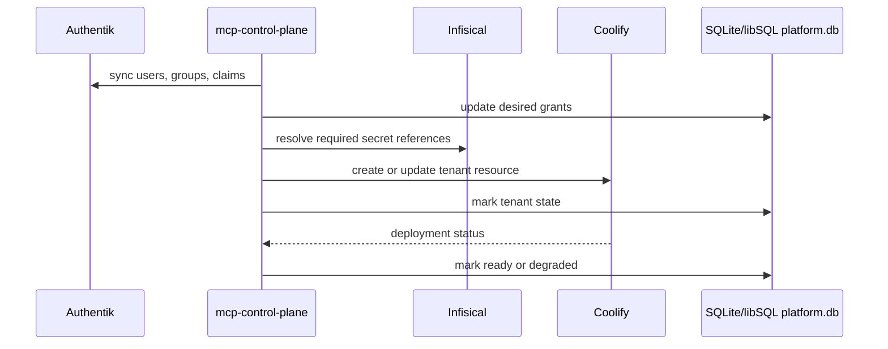

# Engineering Design Document

Document: MCP Control Plane EDD  
Status: Baseline design  
Date: 2026-03-20  
Owner: DragonServer platform

## 1. Purpose

This document defines the engineering design for the DragonServer MCP control plane described in `PRD.md`.

It covers:

- deployment topology
- component responsibilities
- public endpoint contract
- identity and token flows
- Coolify tenant lifecycle
- secret distribution
- data model
- rollout and migration strategy

## 2. Design Summary

The platform consists of six first-class components:

1. `mcp-edge`
2. `mcp-control-plane`
3. SQLite/libSQL platform database volume
4. `infisical`
5. `authentik`
6. private tenant MCP resources managed by Coolify

The core pattern is:

- one shared public edge
- one private backend per `user x service`
- one control plane that reconciles Authentik grants into Coolify tenant resources

## 3. Deployment Topology

## 4. Public Endpoint Model

### 4.1 Canonical Domain

- Public domain: `mcp.zacariahheim.com`

### 4.2 Canonical MCP Service Endpoints

- `https://mcp.zacariahheim.com/mealie/mcp`
- `https://mcp.zacariahheim.com/actualbudget/mcp`
- `https://mcp.zacariahheim.com/memory/mcp`

### 4.3 Metadata and Authorization Endpoints

The MCP edge is responsible for publishing and serving:

- OAuth authorization server metadata at the shared domain root
- protected resource metadata for each MCP service resource
- authorization, token, and registration endpoints needed by remote MCP clients

Because the authorization base URL is derived from the MCP server URL by removing the path, the design deliberately keeps all public MCP services on the same host and distinguishes them by path.

## 5. Core Components

## 5.1 `mcp-edge`

`mcp-edge` is the only public MCP entry point.

Responsibilities:

- expose the public MCP service endpoints
- publish OAuth and MCP authorization metadata
- authenticate MCP clients using browser-based OAuth
- delegate human login to Authentik
- issue MCP-facing access and refresh tokens
- validate tokens on every request
- resolve `subject + service` to the correct tenant backend
- proxy MCP traffic to the private tenant backend
- emit audit events and request logs

Important design choice:

- `mcp-edge` is both the MCP-facing OAuth broker and the MCP resource server
- Authentik remains the upstream identity provider for human users

This design is required because the client UX should resemble Linear, while Authentik is not the primary MCP-facing OAuth system of record for remote clients.

## 5.2 `mcp-control-plane`

`mcp-control-plane` is the lifecycle manager and reconciler.

Responsibilities:

- ingest Authentik users, groups, and claims
- maintain the desired state of user-to-service grants
- manage the service catalog
- create and update tenant resources through the Coolify API
- manage secret bindings from Infisical to tenant resources
- drive redeploys when secrets or service templates change
- reconcile drift between desired state and actual runtime state

Deployment contract:

- the live control plane is a singleton reconciler
- the runtime uses the single-writer SQLite/libSQL core deployment model
- non-leader instances must not report ready or reconcile tenants

## 5.3 SQLite/libSQL platform database

SQLite/libSQL is the durable state store for the platform.

Responsibilities:

- store tenant inventory
- store grant snapshots and reconciliation state
- store OAuth client registration data for MCP clients
- store token/session metadata as needed by the edge
- store audit and provisioning metadata

## 5.4 `infisical`

Infisical is the canonical secret store.

Responsibilities:

- store user-scoped upstream service credentials
- store platform-scoped credentials and keys
- expose secrets to the control plane for synchronized delivery
- support secret rotation workflows

## 5.5 `authentik`

Authentik remains the human identity provider and RBAC source.

Responsibilities:

- user authentication
- group and claim management
- service entitlement source
- upstream OIDC integration for the control plane

## 5.6 Tenant MCP Resources

Each tenant backend is a private Coolify-managed resource representing one `user x service`.

Responsibilities:

- run a single MCP backend instance for one user and one service
- receive only the secrets needed for that service instance
- expose only an internal HTTP endpoint on the `coolify` network
- remain invisible to the public routing surface

## 6. Identity Model

### 6.1 Canonical Subject

The platform uses the immutable OIDC `sub` claim as the primary user identity.

### 6.2 Display Claims

The platform may also use:

- `preferred_username`
- `email`

These are descriptive claims, not the canonical routing identity.

### 6.3 Internal Tenant Key

Tenant names must remain stable even if usernames change.

The control plane should therefore derive an internal tenant key from `sub`, for example:

- `u-<hex(sha256(sub))[0:16]>`

Example Coolify resource names:

- `mcp-mealie-u3f8d2`
- `mcp-actualbudget-u3f8d2`
- `mcp-memory-u3f8d2`

## 7. Authorization Model

### 7.1 Grant Source

The grant source is Authentik group and claim membership.

Recommended group model:

- `mcp-users`
- `mcp-service-mealie`
- `mcp-service-actualbudget`
- `mcp-service-memory`
- `mcp-admin`

### 7.2 Authorization Decision Inputs

Every request decision uses:

- token issuer
- token audience/resource
- token expiry
- token subject
- granted MCP service entitlement
- tenant readiness state

### 7.3 Authorization Result

The edge returns one of:

- authenticated and routed
- authenticated but forbidden
- authenticated but tenant unavailable
- unauthenticated / challenge required

## 8. OAuth and Token Model

### 8.1 Why the Edge Issues Tokens

The desired client UX requires:

- one shared public MCP domain
- browser-based login
- no manual client-by-client pre-registration burden
- compatibility with modern remote MCP client expectations

To support that, `mcp-edge` acts as the MCP-facing authorization server.

It delegates user authentication to Authentik and then issues its own tokens to MCP clients.

### 8.2 Required Capabilities

`mcp-edge` must provide:

- OAuth authorization server metadata
- protected resource metadata
- PKCE-based authorization code flow
- dynamic client registration or an equivalent client registration strategy
- short-lived access tokens
- refresh tokens
- resource/audience binding to the requested MCP service resource

### 8.3 Token Claims

At minimum, MCP-facing tokens should carry:

- `iss`
- `sub`
- `aud`
- `exp`
- `iat`
- `scope`
- `sid` or equivalent session linkage

The edge may also carry derived service authorization state in token or server-side session form, but the source of truth remains the control-plane authorization model.

## 9. Service Catalog Model

The service catalog defines supported MCP services and the runtime contract for each. The code catalog is the bootstrap source used by the control plane to seed the database; the database `service_catalog` table is the runtime projection that the edge consumes outside fixture mode.

Each service catalog entry should include:

- `service_id`
- `display_name`
- `upstream_service_name`
- `transport_type`
- `internal_port`
- `public_path`
- `internal_upstream_path`
- `health_path`
- `health_probe_expectation`
- `resource_profile`
- `secret_contract`
- `persistence_policy`
- `adapter_requirement`

### 9.1 Day-One Catalog

| Service ID | Current Resource | Public Path | Notes |
|---|---|---|---|
| `mealie` | `mealie-mcp` | `/mealie/mcp` | Native streamable HTTP |
| `actualbudget` | `actualbudget-mcp` | `/actualbudget/mcp` | Native HTTP transport today |
| `memory` | `memory` | `/memory/mcp` | Legacy SSE relay with endpoint-event rewriting; not a full streamable-HTTP bridge yet |

## 10. Coolify Tenant Model

### 10.1 Tenant Resource Type

Tenant backends should be created as real Coolify-managed resources through the Coolify API.

Preferred creation path:

- use the Coolify service-oriented API model
- create tenant workloads through the `POST /services` path with service-level compose definitions
- define tenant resources as compose-backed private workloads with no public FQDN

### 10.2 Tenant Resource Requirements

Each tenant resource must:

- join the `coolify` network
- have no public FQDN configured
- publish a private health endpoint
- receive the minimal required environment and secret material
- remain individually visible in the Coolify UI

### 10.3 Desired State and Runtime State

Each tenant instance stores two state dimensions.

Desired state:

- `enabled`
- `disabled`
- `deleted`

Runtime state:

- `provisioning`
- `ready`
- `degraded`
- `disabled`
- `deleting`

The control plane is responsible for converging runtime state toward desired state.

## 11. Secret Model

### 11.1 Canonical Secret Ownership

Infisical is the only secret source of truth.

### 11.2 Path Structure

Recommended path model:

- `/platform/mcp-edge/...`
- `/platform/mcp-control-plane/...`
- `/subjects/<subject_key>/services/mealie/...`
- `/subjects/<subject_key>/services/actualbudget/...`
- `/subjects/<subject_key>/services/memory/...`

Where:

- `subject_key = "u-" + hex(sha256(sub))[0:16]`
- raw `sub` remains canonical in the database and authorization model
- `subject_key` is used for path-safe secret addressing

### 11.3 Secret Delivery

Because tenant MCP servers must remain close to vanilla, the control plane must support compatibility delivery:

- runtime environment variables
- mounted files
- adapter sidecars when required

Default policy:

- secrets originate in Infisical
- the control plane materializes only the minimum runtime subset into the tenant resource
- Coolify holds derived runtime copies only when required for compatibility

### 11.4 Rotation

Secret rotation flow:

1. secret is rotated in Infisical
2. control plane detects version change
3. control plane updates the tenant runtime definition in Coolify
4. control plane triggers a controlled redeploy
5. edge continues routing only after health recovery

## 12. Database Model

The platform database needs, at minimum, the following logical tables:

- `subjects`
  - canonical user identity and synced Authentik metadata
- `service_catalog`
  - supported MCP services and runtime contract
- `service_grants`
  - user-to-service authorization state
- `tenant_instances`
  - desired and actual tenant runtime state
- `oauth_clients`
  - registered MCP client metadata
- `oauth_sessions`
  - authorization sessions and refresh state
- `audit_events`
  - auth, routing, provisioning, and revocation events
- `reconcile_runs`
  - control-plane convergence history

## 13. Request Flow

## 14. Grant Reconciliation Flow

## 15. Migration and Cutover

### 15.1 Current State to Replace

The platform must replace:

- direct public MCP routes such as current service-specific endpoints
- direct internal-container MCP URLs configured in upstream clients
- service-local auth workarounds such as static bearer tokens and ad hoc header injection

### 15.2 Target State

All clients use:

- `https://mcp.zacariahheim.com/mealie/mcp`
- `https://mcp.zacariahheim.com/actualbudget/mcp`
- `https://mcp.zacariahheim.com/memory/mcp`

All tenant backends remain private.

## 16. Rollout Phases

### Phase 1: Platform Foundation

- deploy `infisical`
- initialize the SQLite/libSQL platform database volume through `mcp-control-plane`
- deploy `mcp-control-plane`
- deploy `mcp-edge`
- publish shared public domain and TLS

### Phase 2: Catalog and Reconciliation

- define the service catalog
- implement Authentik grant sync
- implement Coolify tenant resource lifecycle
- implement Infisical-to-tenant secret delivery

### Phase 3: Edge Enforcement

- implement MCP auth metadata and OAuth flows
- implement token issuance and validation
- implement tenant resolution and proxying
- implement audit logging

### Phase 4: Service Cutover

- onboard `mealie`
- onboard `actualbudget`
- onboard `memory`
- remove direct client references to raw MCP containers

### Phase 5: Hardening

- revoke direct public tenant exposure
- add drift detection
- add operational dashboards and alerts
- test revocation, secret rotation, and disaster scenarios

## 17. Failure Modes and Mitigations

| Failure Mode | Impact | Mitigation |
|---|---|---|
| Edge unavailable | Public MCP access fails | Run edge as independent service with health checks and restart policy |
| Authentik unavailable | New logins fail | Preserve existing client refresh sessions where safe; alert quickly |
| Coolify API unavailable | Tenant reconciliation stalls | Keep existing ready tenants serving; queue reconciliation work |
| Secret version mismatch | Tenant auth fails upstream | Versioned secret binding and controlled redeploy |
| Wrong tenant resolution | Cross-user data exposure risk | Resolve only from immutable `sub`, enforce audit, validate every route decision |
| Service transport mismatch | Client incompatibility | Normalize behind the edge, especially for `memory` |

## 18. Implementation Notes

1. The design assumes that all MCP-facing clients will use the shared edge rather than direct service URLs.
2. The design intentionally uses token-based identity, not hostname-based identity.
3. The design intentionally keeps Coolify in the center of runtime operations because tenant visibility in the Coolify UI is a hard requirement.
