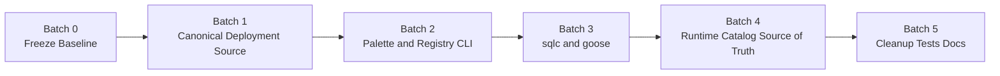

# MCP Platform Refactor Execution Plan

Status: Approved refactor program for the current Go runtime and deployment surface.

This document turns the approved cleanup direction into a gated execution plan for the `mcp-platform` runtime.

It is intentionally batch-oriented, review-heavy, and explicit about what must be true before the next batch begins.

## Objective

Transform the current MVP-style runtime into a maintainable production platform without mixing urgent defect repair with architectural churn.

The program must achieve five outcomes in this order:

1. Collapse the Docker and compose surface into one canonical source with generated variants.
2. Refactor the Cobra layer into palette and registry, with no business logic in commands.
3. Replace handwritten SQL with `sqlc` and standardize migrations on `goose`.
4. Move service catalog entries out of code and env into a runtime-driven disk-backed source of truth with API and CLI write paths.
5. Clean packages, dependency boundaries, tests, and docs last.

## Current Baseline

The plan is grounded in the current repository, not an idealized rewrite.

### Runtime surface today

- Entry points:
  - `mcp-platform/cmd/mcp-control-plane/main.go`
  - `mcp-platform/cmd/mcp-edge/main.go`
- Command logic:
  - `mcp-platform/internal/controlplane/cmd.go`
  - `mcp-platform/internal/edge/cmd.go`
- Control-plane persistence and migration logic:
  - `mcp-platform/internal/controlplane/store.go`
  - `mcp-platform/db/migrations/*.sql`
  - `mcp-platform/db/migrations/embed.go`
- Edge persistence logic:
  - `mcp-platform/internal/edge/state_store.go`
- Catalog logic:
  - `mcp-platform/internal/catalog/service.go`
- Deployment artifacts:
  - `mcp-platform/docker-compose.yaml`
  - `mcp-platform/deploy/coolify/*.compose.yaml`
  - `mcp-platform/deploy/coolify/*.image.compose.yaml`
  - `mcp-platform/Dockerfile.*`

### Structural issues already visible

- Compose and Docker definitions are duplicated across root, combined, per-service, build-mode, and image-mode variants.
- Cobra command packages still construct runtime objects directly instead of delegating through an internal application layer.
- `internal/controlplane/store.go` mixes migration execution, seed logic, SQL orchestration, and repository concerns in one package.
- `internal/edge/state_store.go` contains both storage abstractions and a large persistence implementation surface.
- `internal/catalog/service.go` hardcodes catalog defaults in compiled Go code.
- Catalog bootstrap currently depends on `SeedServiceCatalog()` writing hardcoded entries into the database at runtime.
- The database layer is handwritten and tightly coupled to runtime packages.

## Non-Negotiable Rules

- Do not mix this refactor program with new feature rollout work.
- Do not start a later batch until the earlier batch has passed its acceptance gates.
- Do not preserve duplicated generated artifacts as hand-edited files.
- Do not leave business logic in Cobra commands.
- Do not keep hardcoded catalog entries in Go or env vars after Batch 4.
- Do not perform package cleanup before architecture boundaries are frozen.

## Program Sequence

## Batch 0

### Goal

Create a safe and auditable starting line for the refactor program.

### Scope

- Separate defect-fix work from refactor work.
- Freeze the current runtime contract and repo surface.
- Define what is canonical and what is derived before replacing any implementation.

### Work items

1. Create an ADR that freezes the target deployment-generation approach.
2. Inventory every deployment artifact and classify it as:
   - canonical input
   - generated output
   - runtime binary image definition
   - operator documentation
3. Record the current runtime contract:
   - startup env surface
   - health endpoints
   - migration behavior
   - catalog bootstrap behavior
4. Document current package responsibilities and current violations.
5. Establish branch and review policy for the remaining batches.

### Deliverables

- `mcp-control-plane/REFACTOR_EXECUTION_PLAN.md`
- one ADR for deployment generation direction
- one inventory table for compose and Docker artifacts
- one package responsibility matrix

### Acceptance

- The team can point to one document that says what is canonical today and what will become generated.
- There is no ambiguity about the scope of Batch 1.
- The current runtime contract is frozen well enough to detect regressions later.

### Rollback

- None required beyond reverting docs, because Batch 0 is documentation only.

## Batch 1

### Goal

Collapse the Docker and compose surface into one canonical source with generated variants.

### Target architecture

- One typed deployment model under a canonical package or config directory.
- One generator entrypoint, likely `platformctl generate manifests`.
- All public deployment artifacts become generated outputs.

### Canonical source candidates

- Service definitions:
  - service name
  - build vs image mode
  - env contracts
  - secret mounts
  - healthchecks
  - dependency ordering
  - sidecars
- Deployment shape:
  - combined stack
  - per-service stack
  - build-backed mode
  - image-backed mode

### Concrete work

1. Introduce a manifest model package.
2. Build a generator that emits:
   - `docker-compose.yaml`
   - `deploy/coolify/mcp-platform-core.compose.yaml`
   - `deploy/coolify/mcp-platform-core.image.compose.yaml`
   - `deploy/coolify/mcp-control-plane.compose.yaml`
   - `deploy/coolify/mcp-control-plane.image.compose.yaml`
   - `deploy/coolify/mcp-edge.compose.yaml`
   - `deploy/coolify/mcp-edge.image.compose.yaml`
   - SQLite/libSQL volume wiring in `deploy/coolify/*.compose.yaml`
3. Add generated-file headers that clearly forbid manual edits.
4. Add golden tests that diff generated output.
5. Update docs to describe canonical input plus generator workflow.

### File targets

- New generator package under `mcp-platform/internal` or `mcp-platform/tools`
- `mcp-platform/docker-compose.yaml`
- `mcp-platform/deploy/coolify/*`
- `mcp-platform/Dockerfile.*` only where they remain true runtime sources

### Acceptance

- A single canonical change updates all compose variants via generation.
- No generated compose file is hand-maintained.
- Golden tests fail if generated artifacts drift.
- Repo-backed and image-mode configs still render after generation.

### Rollback

- Revert generator introduction and restore frozen compose artifacts from the Batch 0 baseline if generation proves unstable.

## Batch 2

### Goal

Refactor the CLI into palette and registry, with zero business logic in Cobra commands.

### Target architecture

- `cmd/*/main.go`: bootstrap only
- `internal/cli/palette`: dependency construction
- `internal/cli/registry`: command registration
- `internal/app/*`: use-case layer
- `internal/http/*`: handlers calling the same service layer
- `internal/infra/*`: adapters for DB, Coolify, Infisical, Authentik, filesystem

### Current violations

- `internal/controlplane/cmd.go` builds config, logger, app, signal handling, and health behavior inline.
- `internal/edge/cmd.go` performs server construction and runtime wiring directly.
- Command packages still decide too much about runtime composition.

### Concrete work

1. Create a palette abstraction for shared dependencies.
2. Create registries for control-plane commands and edge commands.
3. Move runtime construction into application bootstrap packages.
4. Keep `healthcheck` as a thin adapter over a service or probe package.
5. Ensure CLI commands call services instead of owning orchestration logic.
6. Define shared application services for:
   - startup
   - health
   - migrations
   - catalog operations
   - reconcile operations

### File targets

- `mcp-platform/cmd/mcp-control-plane/main.go`
- `mcp-platform/cmd/mcp-edge/main.go`
- `mcp-platform/internal/controlplane/cmd.go`
- `mcp-platform/internal/edge/cmd.go`
- new `mcp-platform/internal/cli/*`
- new `mcp-platform/internal/app/*`

### Acceptance

- No Cobra command contains domain orchestration, SQL, or external API workflow logic.
- Command code becomes thin request parsing and response rendering.
- CLI and HTTP can call the same service layer.

### Rollback

- Revert to the pre-refactor command wiring while preserving any non-invasive helper packages if the palette split becomes unstable.

## Batch 3

### Goal

Replace handwritten SQL with `sqlc` and standardize migrations on `goose`.

### Target architecture

- `db/migrations/` owned by `goose`
- `db/queries/` owned by `sqlc`
- repositories wrap generated queries only when domain translation is required

### Current violations

- `internal/controlplane/store.go` runs migrations manually and embeds large query strings.
- `internal/edge/state_store.go` contains a large handwritten persistence implementation.
- Migration application is coupled to runtime store initialization.

### Concrete work

1. Add `goose` and convert migration entrypoints to it.
2. Add `sqlc.yaml`.
3. Split queries by bounded context:
   - control-plane
   - edge
   - catalog later if needed
4. Replace handwritten query strings incrementally.
5. Isolate transactions and retry behavior behind repository boundaries.
6. Remove migration execution from generic store code and move it into a dedicated migration service.

### File targets

- `mcp-platform/db/migrations/*.sql`
- `mcp-platform/db/migrations/embed.go`
- new `mcp-platform/db/queries/*.sql`
- new generated `sqlc` output packages
- `mcp-platform/internal/controlplane/store.go`
- `mcp-platform/internal/edge/state_store.go`

### Acceptance

- No production SQL strings remain in service code.
- Migrations are applied through `goose`.
- `sqlc generate` is part of CI and local workflow.
- Integration tests prove the migration chain and representative query paths.

### Rollback

- Keep the pre-`sqlc` repositories on a branch until parity is proven.
- Revert per bounded context if one migration/query conversion breaks runtime behavior.

## Batch 4

### Goal

Replace compiled and env-driven catalog entries with a runtime-driven disk-backed source of truth.

### Target architecture

- Catalog file on disk, for example `catalog/services.yaml`.
- Atomic write path with validation and locking.
- CLI and API CRUD that mutate the same store.
- Database may cache or project catalog data, but the file on disk is authoritative.

### Current violations

- `internal/catalog/service.go` hardcodes catalog defaults in `DefaultCatalogV1()`.
- `SeedServiceCatalog()` writes those entries into the database automatically.
- The runtime cannot treat catalog state as an operational data plane controlled by CLI or API.

### Concrete work

1. Define a versioned on-disk catalog schema.
2. Build a catalog store package with:
   - read
   - validate
   - write
   - atomic replace
   - backup
3. Remove hardcoded defaults from `internal/catalog/service.go`.
4. Replace bootstrap seeding with:
   - load from disk
   - validate
   - project into DB if needed
5. Add CLI and API write paths.
6. Ensure all non-config mutations write back to disk so the file stays authoritative.
7. Remove env var catalog injection entirely.

### File targets

- `mcp-platform/internal/catalog/service.go`
- new `mcp-platform/internal/catalog/store.go`
- new on-disk config schema under `mcp-platform/catalog/`
- relevant API and CLI surfaces added in Batch 2
- `internal/controlplane/store.go` seeding paths

### Acceptance

- No hardcoded catalog entries remain in Go.
- No env vars define catalog entries.
- Catalog survives restart because file state is authoritative.
- CLI and API catalog mutations are persisted to disk.

### Rollback

- Keep a read-only compatibility loader for one transition window if needed.
- Revert to the frozen catalog baseline file if runtime mutation logic proves unstable.

## Batch 5

### Goal

Clean the package graph, then finish tests, docs, and enforcement.

### Concrete work

1. Move packages to match the boundaries created in Batches 2 through 4.
2. Enforce dependency direction:
   - `cmd -> cli/bootstrap -> app -> domain`
   - infra and transport adapters point inward
3. Add test coverage for:
   - manifest generation
   - service layer behavior
   - sqlc repositories
   - goose migrations
   - catalog store CRUD
   - CLI smoke paths
4. Update docs:
   - architecture docs
   - operator docs
   - generator workflow
   - catalog schema
   - migration workflow
5. Add CI gates for:
   - generated compose drift
   - `sqlc generate`
   - `goose` migration smoke test
   - normal `go test`

### Acceptance

- Package responsibilities are clear and reviewable.
- CI proves generated assets, migration behavior, and catalog persistence.
- The docs describe the final architecture rather than the MVP implementation.

### Rollback

- Roll back package-move only changes separately from functional changes.
- Keep CI gate additions scoped so a failing enforcement gate can be reverted independently of runtime logic.

## Batch Gates

### Gate to start Batch 1

- Batch 0 inventory and ADR are complete.
- Current defect-fix work is either merged or cleanly isolated.

### Gate to start Batch 2

- Generated deployment artifacts are stable.
- There is no remaining ambiguity about which files are generated versus canonical.

### Gate to start Batch 3

- Palette and registry boundaries are in place.
- Runtime services are callable without Cobra-specific construction.

### Gate to start Batch 4

- Persistence boundaries are stable enough that catalog loading and projection can be isolated cleanly.

### Gate to start Batch 5

- Deployment generation, CLI architecture, DB access, and catalog source of truth have all converged.

## Risks

- The deployment surface is currently duplicated enough that Batch 1 will touch many files quickly.
- The CLI refactor can become cosmetic if service boundaries are not enforced aggressively.
- `sqlc` adoption will fail if query ownership is not separated by bounded context first.
- Catalog refactoring will fail if the team treats the DB as authoritative after declaring disk config the source of truth.
- Cleanup before boundaries settle will create a large diff with little real improvement.

## Recommended Immediate Next Step

Execute Batch 0 as a documentation and inventory batch only.

That batch should end with:

- one ADR for deployment generation direction
- one compose and Docker inventory
- one package responsibility matrix
- one refined task list for Batch 1 with exact generator inputs and outputs
